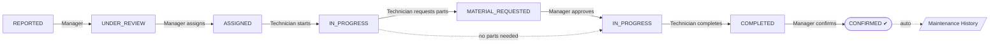
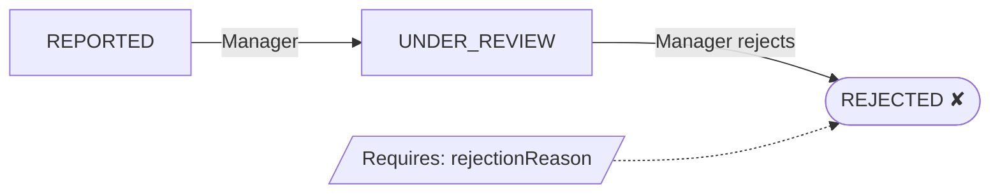
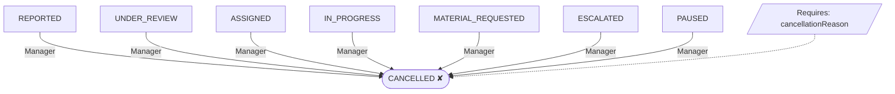
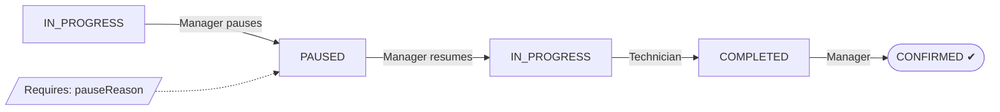
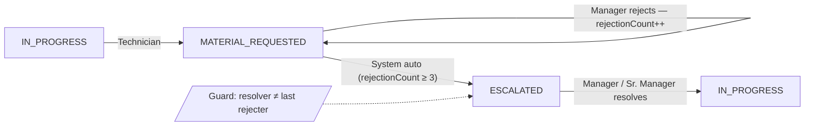
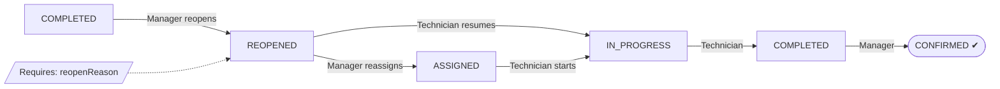
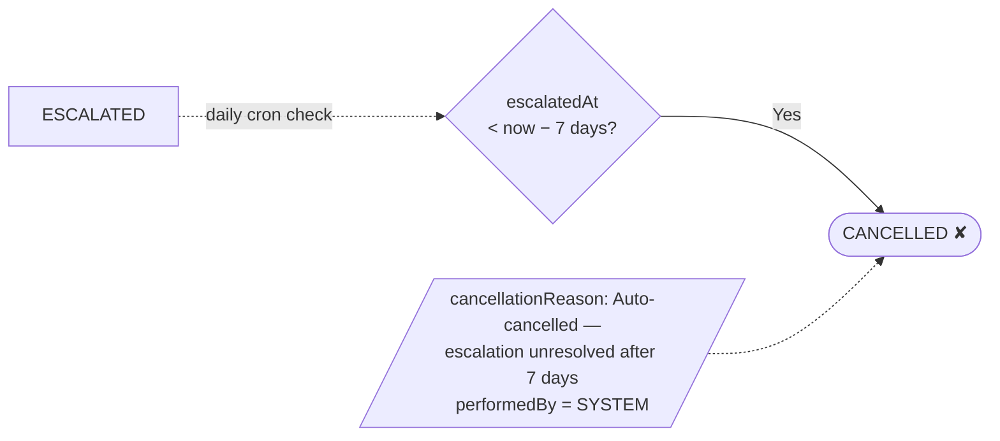

# Factory Asset Maintenance (FAM) System

A full-stack web application for managing factory machinery maintenance tasks, built with **Next.js 16**, **TypeScript**, **MongoDB / Mongoose**, and **Tailwind CSS v4**.

---

## Table of Contents

1. [Prerequisites](#1-prerequisites)
2. [Clone the Repository](#2-clone-the-repository)
3. [Install Dependencies](#3-install-dependencies)
4. [Set Up MongoDB Locally](#4-set-up-mongodb-locally)
5. [Configure Environment Variables](#5-configure-environment-variables)
6. [Seed the Database](#6-seed-the-database)
7. [Run the Development Server](#7-run-the-development-server)
8. [Login Credentials](#8-login-credentials)
9. [Available Scripts](#9-available-scripts)
10. [Running Tests](#10-running-tests)
11. [Project Structure](#11-project-structure)
12. [Tech Stack](#12-tech-stack)
13. [Deploying to Production](#13-deploying-to-production)

---

## 1. Prerequisites

Make sure these are installed before you begin:

| Tool | Minimum Version | Download |
|------|----------------|----------|
| Node.js | 20.x or 22.x LTS | https://nodejs.org |
| npm | 10.x (comes with Node) | — |
| MongoDB Community | 7.x | https://www.mongodb.com/try/download/community |
| Git | Any recent version | https://git-scm.com |

Verify installs:
```bash
node -v       # should print v20.x.x or v22.x.x
npm -v        # should print 10.x.x
mongod --version   # should print db version v7.x
git --version
```

---

## 2. Clone the Repository

```bash
git clone https://github.com/YOUR_USERNAME/factory-asset-maintenance.git
cd factory-asset-maintenance
```

---

## 3. Install Dependencies

```bash
npm install
```

This installs all runtime and development dependencies listed in `package.json`.

---

## 4. Set Up MongoDB Locally

### Option A — MongoDB installed on your machine

**Windows:**
```powershell
# Start MongoDB service (if installed as a service)
net start MongoDB

# Or start manually, pointing to a data directory
mongod --dbpath "C:\data\db"
```

**macOS / Linux:**
```bash
# macOS with Homebrew
brew services start mongodb-community

# Linux (systemd)
sudo systemctl start mongod
```

Verify it is running:
```bash
mongosh
# Should open the MongoDB shell. Type `exit` to close.
```

### Option B — Use MongoDB Atlas (cloud, no local install)

1. Create a free cluster at https://cloud.mongodb.com
2. Create a database user and allow access from your IP
3. Copy the connection string (see [DEPLOYMENT.md](DEPLOYMENT.md) Phase 1 for detailed steps)
4. Use that URI as `MONGODB_URI` in the next step

---

## 5. Configure Environment Variables

Copy the example file to create your local config:

```bash
# Windows PowerShell
Copy-Item .env.example .env.local

# macOS / Linux
cp .env.example .env.local
```

Open `.env.local` and fill in the values:

```env
# Local MongoDB (if running MongoDB on your machine)
MONGODB_URI=mongodb://localhost:27017/factory-asset-maintenance

# JWT — must be at least 32 characters. Generate one:
# node -e "console.log(require('crypto').randomBytes(32).toString('hex'))"
JWT_SECRET=replace-this-with-a-long-random-string-at-least-32-chars
JWT_EXPIRES_IN=8h

# App URL for local development
NEXT_PUBLIC_APP_URL=http://localhost:3000

NODE_ENV=development

# Business rules (defaults are fine for local dev)
ESCALATION_REJECTION_THRESHOLD=3
ESCALATION_AUTO_CANCEL_DAYS=7
BCRYPT_ROUNDS=12
```

> **Important:** `.env.local` is in `.gitignore` and will never be committed.

---

## 6. Seed the Database

Populate the database with demo users, machinery, and inventory:

```bash
npm run seed
```

You should see output like:
```
🌱 Starting database seed...
✅ Connected to MongoDB
🗑️  Cleared existing data from: users, machinery, inventory
✅ Created 7 users
✅ Created 6 machines
✅ Created 10 inventory items
🎉 Seed complete!
```

If you see `❌ MONGODB_URI is not defined`, check that `.env.local` exists and contains a valid `MONGODB_URI`.

---

## 7. Run the Development Server

```bash
npm run dev
```

Open **http://localhost:3000** in your browser. The app redirects to `/login` automatically.

> Next.js uses Turbopack in dev mode for fast HMR. The first start may take a few seconds to compile.

---

## 8. Login Credentials

These accounts are created by the seed script:

| Role | Email | Password |
|------|-------|----------|
| Senior Manager | `srmanager@factory.com` | `Admin@1234` |
| Manager | `manager@factory.com` | `Admin@1234` |
| Manager 2 | `manager2@factory.com` | `Admin@1234` |
| Technician 1 | `tech1@factory.com` | `Tech@1234` |
| Technician 2 | `tech2@factory.com` | `Tech@1234` |
| User 1 | `user1@factory.com` | `User@1234` |
| User 2 | `user2@factory.com` | `User@1234` |

### Role Capabilities

| Action | USER | TECHNICIAN | MANAGER | SENIOR_MANAGER |
|--------|------|------------|---------|----------------|
| Report an issue (create task) | ✅ | — | ✅ | ✅ |
| View own tasks | ✅ | — | ✅ | ✅ |
| View assigned tasks | — | ✅ | — | — |
| View all tasks | — | — | ✅ | ✅ |
| Assign technicians | — | — | ✅ | ✅ |
| Approve/reject material requests | — | — | ✅ | ✅ |
| View machinery | ✅ | ✅ | ✅ | ✅ |
| View maintenance history | — | — | ✅ | ✅ |
| View inventory | — | — | ✅ | ✅ |

---

## 9. Available Scripts

| Script | Command | Description |
|--------|---------|-------------|
| Development server | `npm run dev` | Starts Next.js on http://localhost:3000 with HMR |
| Production build | `npm run build` | Compiles and optimises the app |
| Production server | `npm run start` | Serves the production build (run `build` first) |
| Seed database | `npm run seed` | Inserts demo data into MongoDB |
| Run all tests | `npm test` | Runs the full Jest test suite |
| Tests in watch mode | `npm run test:watch` | Re-runs tests on file save |
| Test coverage report | `npm run test:coverage` | Generates coverage in `coverage/` |
| Type check | `npm run type-check` | Runs `tsc --noEmit` without emitting files |
| Lint | `npm run lint` | Runs ESLint across all source files |
| Format | `npm run format` | Formats source files with Prettier |

---

## 10. Running Tests

The project has two test suites:

### Unit tests
```bash
npm test -- --testPathPattern="tests/unit"
```
Tests pure logic: JWT auth, model validation, role-based visibility, state machine transitions, API helpers, error classes.

### Integration tests
```bash
npm test -- --testPathPattern="tests/integration"
```
Tests full API routes using `mongodb-memory-server` (no real MongoDB needed — it spins up an in-memory instance automatically).

### All tests + coverage
```bash
npm run test:coverage
```
Coverage report is written to `coverage/lcov-report/index.html` — open that in a browser for a detailed breakdown.

---

## 11. Project Structure

```
factory-asset-maintenance/
├── scripts/
│   └── seed.ts                  # Database seeder
├── src/
│   ├── app/
│   │   ├── (auth)/login/        # Login page
│   │   ├── (dashboard)/         # All authenticated pages
│   │   │   ├── layout.tsx       # Sidebar shell layout
│   │   │   ├── page.tsx         # Dashboard home (stats + recent tasks)
│   │   │   ├── tasks/           # Task list, task detail, new task
│   │   │   ├── machinery/       # Machinery grid + history modal
│   │   │   └── inventory/       # Inventory table
│   │   ├── api/                 # Next.js API routes
│   │   │   ├── auth/            # Login / logout / me
│   │   │   ├── tasks/           # CRUD + status transitions
│   │   │   ├── machinery/       # Machinery + history
│   │   │   ├── inventory/       # Inventory read
│   │   │   └── users/           # User management
│   │   ├── globals.css
│   │   └── layout.tsx
│   ├── components/              # Shared UI: StatusBadge, PriorityBadge
│   ├── context/
│   │   └── AuthContext.tsx      # Client-side auth state
│   ├── lib/
│   │   ├── auth.ts              # JWT sign / verify
│   │   ├── db.ts                # Mongoose connection with caching
│   │   ├── apiClient.ts         # Browser-side fetch wrapper
│   │   ├── apiHelper.ts         # Server-side response helpers
│   │   ├── errors.ts            # Custom error classes
│   │   ├── taskCode.ts          # Unique task code generation
│   │   ├── transitionGuard.ts   # State machine rules
│   │   └── visibility.ts        # RBAC query filters
│   ├── models/                  # Mongoose schemas
│   ├── services/                # Business logic (MaterialService, TaskService)
│   └── types/                   # Shared TypeScript types
├── tests/
│   ├── unit/                    # Pure unit tests
│   └── integration/             # Full API route tests
├── .env.example                 # Template — copy to .env.local
├── DEPLOYMENT.md                # Production deployment guide (Vercel)
├── next.config.ts
├── tailwind.config.ts
├── tsconfig.json
└── package.json
```

---

### Workflow Scenario Diagrams (from `Overview.drawio`)

GitHub cannot render multi-page `.drawio` files inline in Markdown, so the scenarios are mirrored below using Mermaid for direct preview in the repository README.

Source file: [`Overview.drawio`](Overview.drawio)

#### 01 Happy Path

Full lifecycle from report to confirmed resolution, with optional material sub-flow.



#### 02 Task Rejected

Manager rejects during review — terminal state.



#### 03 Cancellation Paths

Manager can cancel from any of the 7 non-terminal active states.



#### 04 Pause and Resume

Manager temporarily halts work; SLA clock stops while paused.



#### 05 Escalation Resolution

Material request rejected 3+ times triggers auto-escalation; a different manager or senior manager resolves.



#### 06 Reopen Loop

Manager reopens a completed task — same tech resumes or manager reassigns.



#### 07 Escalation Auto-Cancel

Daily cron job cancels escalations unresolved for 7+ days; performedBy = SYSTEM.



---

## 12. Tech Stack

| Layer | Technology |
|-------|-----------|
| Framework | Next.js 16 (App Router) |
| Language | TypeScript 5 |
| Styling | Tailwind CSS v4 |
| Database | MongoDB 7 via Mongoose 9 |
| Auth | JWT (jsonwebtoken) + bcryptjs |
| Validation | Zod 4 |
| Testing | Jest 30 + Testing Library + Supertest |
| In-memory DB (tests) | mongodb-memory-server |
| Rate limiting | Upstash Redis (optional) |

---

## 13. Deploying to Production

See **[DEPLOYMENT.md](DEPLOYMENT.md)** for the full step-by-step guide to deploying to Vercel with MongoDB Atlas.

Quick summary:
1. Create MongoDB Atlas cluster → get connection URI
2. Generate a strong `JWT_SECRET`
3. Push code to GitHub
4. Import repo in Vercel, set all env vars, deploy
5. Run `npm run seed` pointing at the Atlas URI to populate production data

---

## Troubleshooting

### `npm run dev` exits immediately
- Ensure MongoDB is running: `mongod --version` then start it (see Step 4)
- Check `.env.local` exists and `MONGODB_URI` is correct

### Port 3000 already in use
```powershell
# Windows - find and kill the process on port 3000
netstat -ano | findstr :3000
taskkill /PID <PID> /F
```
```bash
# macOS / Linux
lsof -ti:3000 | xargs kill -9
```

### Seed fails with "MONGODB_URI is not defined"
- Confirm `.env.local` exists in the project root (not inside `src/`)
- Confirm the file is named exactly `.env.local` (not `.env`)

### TypeScript errors on build
```bash
npm run type-check   # see all errors at once
```

### Tests fail with "Cannot connect to MongoDB"
Integration tests use `mongodb-memory-server` — no real MongoDB needed. If they fail with a connection error, try:
```bash
# Clear the binary cache and let it re-download
npx mongodb-memory-server-cli clean
npm test
```
